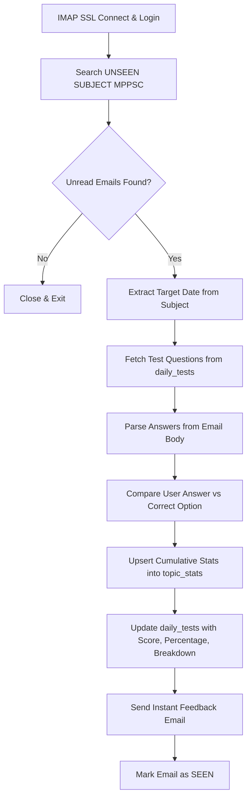

# Email Evaluation & Grading Workflow

## Overview
Polls Gmail inbox over IMAP SSL, searches for unread replies matching MPPSC daily drills, extracts candidate answers using flexible regex patterns, evaluates accuracy against the stored answer key in Supabase PostgreSQL, and dispatches a detailed breakdown email with cumulative mastery statistics.

## Evaluation Flow

## Answer Extraction Rules

1. **Numbered Patterns**: Supports standard reply formats like `1A 2B 3C` or `Q1: A\nQ2: B`.
2. **Compact String Fallback**: Supports compact character strings like `ACDBACDB...` stripping quoted email reply text.
3. **Mastery Tracking**:
   - `🟢 Strong` (>= 80% accuracy)
   - `🟡 Moderate` (60% - 79% accuracy)
   - `🔴 Needs Focus` (< 60% accuracy)

4. **Absent Policy**:
   - Tests older than today that remain `PENDING` are automatically transitioned to `ABSENT` with score 0.
