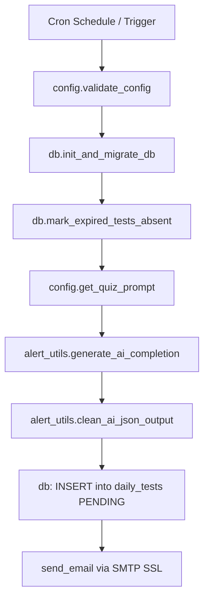

# MPPSC Quiz Generation & Dispatch Pipeline

## Overview
Automates the daily drill distribution for MPPSC State Services Prelims preparation. It generates high-yield MCQs using Gemini/Groq with strict token optimization constraints, persists questions into Supabase PostgreSQL, and emails a responsive HTML quiz to the candidate.

## Pipeline Architecture

## Key Guidelines

1. **Dual AI Provider Failover**:
   - Primary provider configured via `LLM_PROVIDER` in `.env` (`gemini` or `groq`).
   - Gemini models: `gemini-2.5-flash`, `gemini-2.0-flash`, `gemini-2.0-flash-lite`, `gemini-1.5-flash`.
   - Groq open-source models: `deepseek-r1-distill-llama-70b`, `qwen-2.5-32b`, `mistral-saba-24b`, `gemma2-9b-it`.
   - Automatic fallback between Gemini and Groq if rate limits (429) or timeouts occur.

2. **Token Optimization**:
   - Explanation per question is capped strictly to `<= 15 words`.
   - Pure JSON schema enforced (`application/json` or Groq `json_object`).
   - Reasoning blocks (e.g., `<think>...</think>`) and markdown fences automatically stripped by `clean_ai_json_output`.

3. **Topic Customization**:
   - If `TOPICS` is specified in `.env`, generates `QUESTIONS_PER_TOPIC` questions per topic.
   - If `TOPICS` is blank, generates `TOTAL_QUESTIONS` from the general MPPSC Prelims syllabus (MP GK, Unit 9 ICT, Unit 10 Tribes & Culture, History, Polity, Geography).

4. **Previous Day Solutions & Score Review**:
   - Before today's questions, `db.get_previous_test_data` fetches the prior drill record.
   - Embeds yesterday's score badge (Evaluated / Absent / Pending) along with collapsible question-by-question solutions, candidate answer comparisons, correct options, and concise explanations.

5. **Error Handling**:
   - All failures trigger `send_error_alert` with stack trace sent to the user's email.

